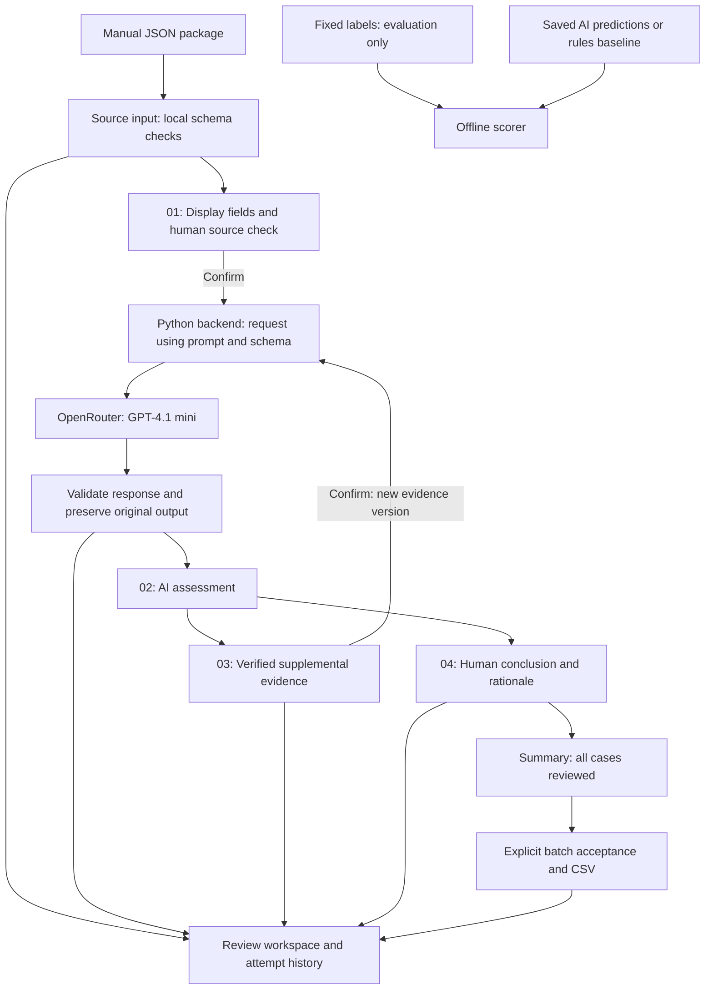

# Product Documentation

## Persona and intended use

The primary user is an audit associate reviewing year-end trade receivables for an industrial goods seller. They understand audit evidence and recognition principles but need a consistent way to compare contract conditions, delivery facts and ledger dates across transactions. The prototype helps assemble a reviewable finding; the auditor owns the conclusion.

The demonstrated contribution is a traceable path from structured evidence to an AI suggestion and an explicit human decision. Reduced review time and improved real-world audit quality are hypotheses, not measured benefits.

## Inputs and outputs

Inputs are a manually uploaded JSON package: reporting dates, currency, scope assumptions, and linked contract, ledger, invoice and delivery records for each case. The formal evaluation uses 80 synthetic cases. The recorded walkthrough uses one unchanged normal case, TEST-001, supplied in `demo_examples/TEST-001_input.json`. This demonstration subset does not replace the formal evaluation. Unknown required delivery facts are represented as null. All tested transactions have a fixed price and one full batch.

Outputs include recognition condition, qualifying date, quantities, cut-off classification, absolute difference, explanation, evidence references and evidence requests. Human conclusions and amounts are recorded separately. Working and accepted CSV summaries expose both AI and human decisions.

## Architecture

The local version saves its workspace on the computer. The Render adapter isolates browser workspaces on temporary instance storage, which does not guarantee retention across restarts.

Answer keys are not sent to the model or displayed by the operational UI. The rules baseline is evaluated separately and is not part of the auditor's screen. The backend shares request, validation and scoring utilities with the command-line evaluator. The browser never receives the API key.

## Human checkpoints

Confirmation in step 01 immediately runs one AI assessment. Confirmation of supplemental evidence immediately reruns the affected case. Each rerun invalidates the prior human review and batch acceptance. A missing-evidence output is not itself an accounting error. The reviewer may resolve an unnecessary evidence request using existing evidence, with an explicit rationale.

Final acceptance is blocked until every transaction has a resolved human decision and amount. Reset clears only demo state and its artifacts; it preserves submitted datasets and formal evaluation evidence.

## Targeted and achieved metrics

Original evaluation objectives were to detect the planted cut-off errors, count false flags, distinguish unknown from zero, identify evidence gaps and measure API cost. The construction included 12 planted errors, but no independently verified pre-run numerical acceptance threshold has been recovered. Do not portray achieved scores as pre-registered targets.

| Metric | Evaluation objective | Observed AI outcome |
|---|---|---:|
| Error detection | Find planted errors, denominator 12 | 12/12 |
| False flags | Measure unnecessary error alerts | 6/60 normal cases |
| Classification | Match fixed labels | 71/80 |
| Amount fields | Match expected amount or null | 71/80 |
| Evidence deferral | Recognize genuine missing evidence without over-deferring | 8/8 correct, plus 3 unnecessary |
| Error-flag precision | Report reliability of error alerts | 12/18 (66.7%) |
| Request latency | Observe operational response time | 282.454 seconds summed over 80 calls |
| API cost | Observe provider-reported cost | USD 0.0678932 for the complete formal run |

These results do not include human corrections, all project spending or reviewer labor. The non-AI baseline achieved 80/80 on the same simplified templates. Broader numerical acceptance goals should be set prospectively for a genuinely new evaluation.

## Scope and future direction

Manual structured input is intentional. AI extraction from PDFs, contracts, invoice scans and delivery records is future work. It would need traceable source passages, separate extraction-quality evaluation and human verification before audit judgment. A hybrid architecture separating language interpretation from deterministic period comparison and arithmetic is another untested future direction. Neither capability is claimed as validated here.
